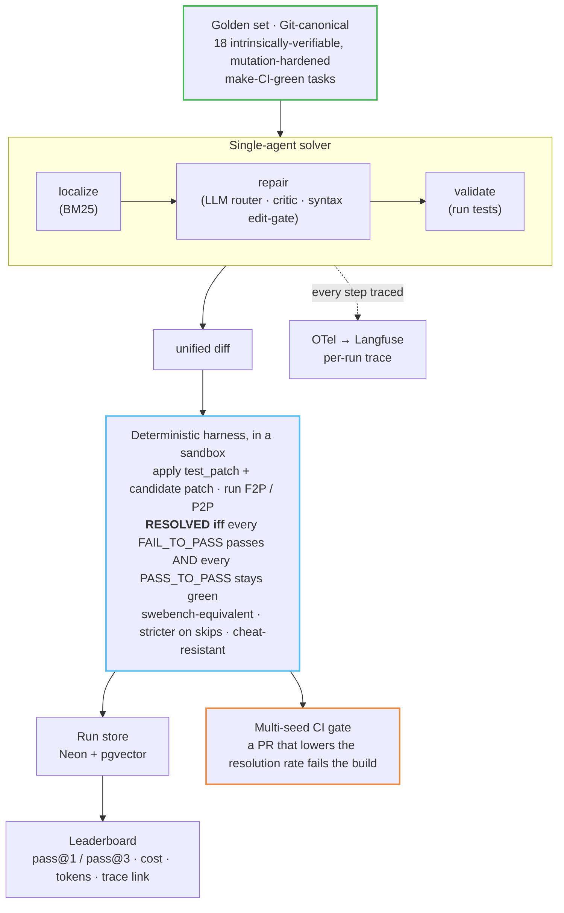
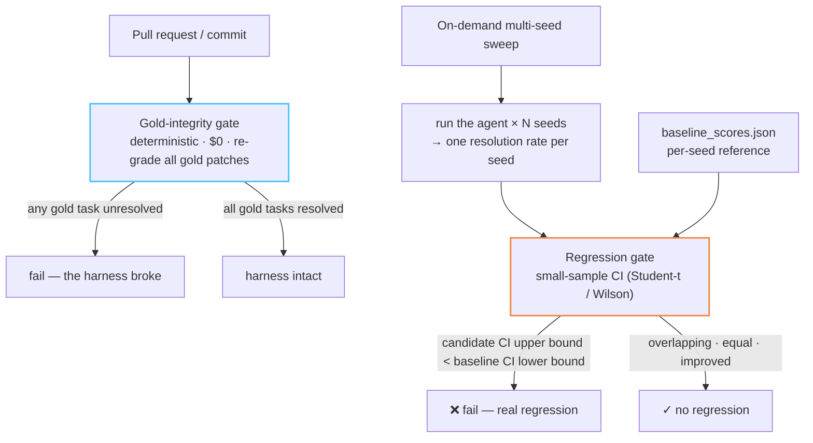

<div align="center">

# ForgeJudge

**An open leaderboard and CI gate for autonomous coding agents — every patch runs in a sandbox, every run is traced, every regression fails the build.**

> **📦 Archived (2026-09-28).** ForgeJudge is no longer maintained and nothing runs on a schedule any more. The leaderboard is frozen at the last complete sweep (2026-07-02, 162 runs). Two of its three models have since been retired by Groq. **[Archive notes & how to rerun it in a fork →](./docs/ARCHIVE.md)**

[](https://github.com/ahmedEid1/forgejudge/actions/workflows/ci.yml)
[](https://github.com/ahmedEid1/forgejudge/actions/workflows/gate.yml)
[](./LICENSE)
[](https://www.python.org)

**▶ Archived leaderboard (frozen 2026-07-02): [forgejudge.ahmedhobeishy.tech](https://forgejudge.ahmedhobeishy.tech)** · [playground](https://forgejudge.ahmedhobeishy.tech/playground) · [methodology](https://forgejudge.ahmedhobeishy.tech/methodology) · [model swap](https://forgejudge.ahmedhobeishy.tech/model-swap) · [MCP registry](https://registry.modelcontextprotocol.io/v0/servers?search=forgejudge)

</div>

<!-- mcp-name: io.github.ahmedEid1/forgejudge -->
<!-- ^ ownership proof for the MCP registry (validated against this PyPI long-description). -->


> **Final results** — the last complete sweep, 2026-07-02 ([run #34](https://github.com/ahmedEid1/forgejudge/actions/runs/28573886970); hidden-test = the agent never sees the failing test; $0 free tier; same harness, swap the model; 18 tasks × 3 seeds = 54 runs/model, 162 total):
>
> | Model | pass@1 | pass@3 | Status today |
> |---|---|---|---|
> | `llama-3.3-70b-versatile` | 98.1% | 100% | retired by Groq 2026-08-16 |
> | `gpt-oss-120b` | 94.4% | 94.4% | available |
> | `llama-3.1-8b-instant` | 57.4% | 72.2% | retired by Groq 2026-08-16 |
>
> With the harness fixed, the 8B model trails the 70B/120B models by ~40 points (the model-swap signal), and `pass@3 ≥ pass@1` reflects run-to-run variance — which is exactly why the CI gate is multi-seed. Every run's patch is in [`runs.json`](./dashboard/public/data/runs.json) and re-grades to the same verdict; the Langfuse trace links pointed at the original project and are not expected to resolve any more. Details, later unpublished sweeps and the retired models: [`docs/ARCHIVE.md`](./docs/ARCHIVE.md).

ForgeJudge is an open-source autonomous software-engineering agent that **proved its quality in public on every commit** while it was active: a hand-rolled single-agent solver, a deterministic execution-as-judge harness, a leaderboard with per-run traces (now a frozen snapshot), and a CI gate that blocks regressions — all on a **`$0` / self-hostable** stack against a **contamination-resistant, intrinsically-verifiable** golden set.

> **The engineered harness, observability, and gate are the deliverable — not a high resolution rate.** A `$0` free-model agent will score modestly *by design*. We prove value with a **model-swap comparison**: the score rises with a better model while the harness stays fixed.

## How it works


```mermaid
flowchart TD
    G["Golden set · Git-canonical<br/>18 intrinsically-verifiable, mutation-hardened<br/>make-CI-green tasks"]

    subgraph SOLVER["Single-agent solver"]
        direction LR
        L["localize<br/>(BM25)"] --> R["repair<br/>(LLM router · critic · syntax edit-gate)"] --> V["validate<br/>(run tests)"]
    end

    G --> SOLVER
    SOLVER --> PATCH["unified diff"]
    SOLVER -. "every step traced" .-> TRACE["OTel → Langfuse<br/>per-run trace"]

    PATCH --> H["Deterministic harness, in a sandbox<br/>apply test_patch + candidate patch · run F2P / P2P<br/><b>RESOLVED iff</b> every FAIL_TO_PASS passes AND every PASS_TO_PASS stays green<br/>swebench-equivalent · stricter on skips · cheat-resistant"]

    H --> STORE["Run store<br/>Neon + pgvector"]
    STORE --> LB["Leaderboard<br/>pass@1 / pass@3 · cost · tokens · trace link"]
    H --> GATE["Multi-seed CI gate<br/>a PR that lowers the resolution rate fails the build"]

    style G stroke:#3fb950,stroke-width:2px
    style H stroke:#4cc2ff,stroke-width:2px
    style GATE stroke:#f0883e,stroke-width:2px
```

- **Solver** — a single, phase-structured loop (`localize → repair → validate`), *not* a multi-agent swarm: cheapest, most deterministic, most debuggable. BM25 localization, an LLM router over free tiers, a syntax edit-gate, a cheap critic pre-filter, and a cost/step budget with autosubmit.
- **Harness** — encodes the SWE-bench `RESOLVED_FULL` rule and is **verified equivalent to `swebench.harness.grading`** on real PASS/FAIL/ERROR/XFAIL outcomes in CI — and *deliberately stricter* on a **skipped** `FAIL_TO_PASS`: swebench 4.1.0 rates a skipped oracle test `RESOLVED_FULL` (a skip is neither success nor failure), so a patch that makes the oracle *skip* rather than run grades as resolved. ForgeJudge counts a skip as not-passed, closing that cheat vector. Patches are also **cheat-resistant**: the canonical test files are restored before grading, so a patch can't neuter the oracle.
- **Golden set** — 15 purpose-built post-cutoff fixtures + 3 tasks mined from the author's own repos (real commit SHAs, MIT/own license — zero leak/copyleft risk). Each is **mutation-hardened**: a wrong fix to the patched region is caught (16 mutation-hardened at mean score 0.94; 2 inconclusive for regex/string code; **0 weak**).
- **Sandbox / CI / sweep** — GitHub Actions on a public repo does triple duty (ephemeral isolated VM sandbox + regression gate + leaderboard sweep) at `$0`. The sweep ran nightly until the archive; it is manual (`workflow_dispatch`) now.
- **Observability** — OpenTelemetry GenAI spans (`invoke_agent → retrieval / chat / execute_tool`, `gen_ai.usage.*`, a `gen_ai.evaluation.result` pass/fail verdict) exported to Langfuse Cloud; every run recorded a trace link (in the original Langfuse project; since the archive the links are not expected to resolve).

### Two gates, two jobs

The deterministic **gold-integrity gate** (does the harness itself still work?) is kept separate from the stochastic **regression gate** (did a change make the *agent* meaningfully worse?) — because gold grading is deterministic and must never be averaged with noisy per-seed runs.


```mermaid
flowchart TD
    PR["Pull request / commit"] --> GG["Gold-integrity gate<br/>deterministic · $0 · re-grade all gold patches"]
    GG -->|"any gold task unresolved"| F1["fail — the harness broke"]
    GG -->|"all gold tasks resolved"| OK1["harness intact"]

    CRON["On-demand multi-seed sweep"] --> SEEDS["run the agent × N seeds<br/>→ one resolution rate per seed"]
    SEEDS --> RG["Regression gate<br/>small-sample CI (Student-t / Wilson)"]
    BASE["baseline_scores.json<br/>per-seed reference"] --> RG
    RG -->|"candidate CI upper bound &lt; baseline CI lower bound"| F2["❌ fail — real regression"]
    RG -->|"overlapping · equal · improved"| OK2["✓ no regression"]

    style GG stroke:#4cc2ff,stroke-width:2px
    style RG stroke:#f0883e,stroke-width:2px
```

## Quickstart

Prereq: [`uv`](https://docs.astral.sh/uv/) (Python 3.12 is provisioned for you) — `curl -LsSf https://astral.sh/uv/install.sh | sh`.

```bash
git clone https://github.com/ahmedEid1/forgejudge && cd forgejudge
uv sync                       # Python 3.12, deps via uv

# Run the deterministic harness self-test (no API key, no network):
uv run python -m forgejudge.harness.runner_actions --patch-source gold   # 18/18 resolved

# Solve a task with a free model and grade it.
# Needs a (free) Groq key. Either export it, or put it in .env and pass --env-file:
#   export GROQ_API_KEY=...                     # or
#   cp .env.example .env && edit GROQ_API_KEY   # then: uv run --env-file .env python - <<'PY'
uv run python - <<'PY'
from forgejudge.golden.loader import load_tasks
from forgejudge.agent.solver import solve
from forgejudge.harness.grade import grade
task = {t.instance_id: t for t in load_tasks("golden/dataset.jsonl")}["fixture-semver-001"]
res = solve(task, run_id="demo", budget_usd=0.10, seed=0)
print(res.status, "→ resolved:", grade(task, res.patch).resolved)
PY
```

Fast tests: `uv run pytest -m "not slow"`. Full golden validation + mutation hardening: `uv run pytest -m slow`. Sweep one model without a database: `uv run --env-file .env python -m forgejudge.eval.sweep --model groq/openai/gpt-oss-120b --seeds 0,1,2 --no-store --out runs-0.jsonl`. The full rerun guide (secrets, database, deploy) is in [`docs/ARCHIVE.md`](./docs/ARCHIVE.md#3-rerun-it-in-a-fork). See [`CONTRIBUTING.md`](./CONTRIBUTING.md) for the full pytest marker map and dev workflow.

## Install

Working on the agent/harness itself? Clone and `uv sync` (above). To consume ForgeJudge as a package:

> The published `forgejudge==0.1.0` predates the archive: its `models.yaml` still lists the retired `llama-3.3-70b-versatile` in several role chains. `solve()` still works through its `gpt-oss-120b` primary, but for the current chains install from git (`pip install git+https://github.com/ahmedEid1/forgejudge`).

```bash
# Library + the `forgejudge` CLI (selftest / mcp / info):
pip install forgejudge
forgejudge selftest           # deterministic harness check — 18/18 resolved, no key
forgejudge mcp                # MCP server over stdio (needs the [mcp] extra)

# Zero-install MCP server (no venv to manage) — for an MCP client config:
uvx --from "forgejudge[mcp]" forgejudge mcp
```

Optional extras (installed only when you need them):

| Extra | Pulls in | For |
|---|---|---|
| `forgejudge[harness]` | `swebench` | the swebench-equivalence grading check |
| `forgejudge[mcp]` | `fastmcp` | the MCP server (`forgejudge mcp`) |
| `forgejudge[playground]` | `fastapi`, `uvicorn`, `httpx` | the guarded live playground API (self-host; the hosted instance is no longer maintained) |

```bash
pip install "forgejudge[mcp]"            # one extra
pip install "forgejudge[harness,mcp]"    # several
```

`forgejudge selftest` and `forgejudge info` work with the base install — no extras, no API key, no network.

## Six objections, pre-empted

1. **"Your benchmark is contaminated / cherry-picked."** The golden set is freshly authored / post-cutoff, sourced only from the author's own repos + fixtures (no third-party leak surface), and **mutation-hardened** so a wrong patch can't pass. SWE-bench Verified is now widely held contaminated — OpenAI [stopped reporting it](https://openai.com/index/why-we-no-longer-evaluate-swe-bench-verified/) (2026-02); >32% of "passed" cases [leaked the solution](https://arxiv.org/abs/2410.06992) and ~31% passed on weak tests. Decontamination here is a documented, tested property — not a footnote.
2. **"Thin wrapper around an LLM / a framework."** The orchestrator is hand-rolled (no LangChain): the control loop, the sandbox-and-score harness, the cheat-resistant grader, the mutation hardener, the OTel instrumentation, and the multi-seed CI gate are the work.
3. **"Your resolution rate is low vs SOTA."** SOTA is ~88–94% with premium models and budgets; a `$0` free-model number is modest *on purpose*. The deliverable is the engineered system; the **model-swap comparison** (score rises with a better model, harness fixed) is the proof.
4. **"Is it actually autonomous or staged?"** Every run recorded an OpenTelemetry/Langfuse trace, and every stored patch re-grades deterministically to its recorded verdict. The replay-first playground demos a real solve without exposing cost/abuse surface.
5. **"Three agent projects — one-trick pony?"** One eval methodology — golden set + judge + traces + CI gate — across three domains at rising autonomy (Lumen → Thoth → ForgeJudge).
6. **Determinism.** temperature=0 does [not guarantee determinism](https://arxiv.org/pdf/2602.07150) (pass@1 varies 2–6pp). The scorer is fully deterministic; the **gate is multi-seed** (fail only when the candidate's CI upper bound is below the baseline's CI lower bound), so flaky single runs don't break the build.

## Repository layout

| Path | What |
|---|---|
| `forgejudge/golden/` | golden-set loader, fixture contract, dataset builder, mutation hardener |
| `forgejudge/harness/` | deterministic `grade()`, cheat-resistant runner, swebench-equivalence check, sandbox executor |
| `forgejudge/agent/` | `localize → repair → validate` solve loop, critic |
| `forgejudge/llm/` | role-based LiteLLM router with fallback + cost accounting |
| `forgejudge/obs/` | OpenTelemetry GenAI tracing → Langfuse / Phoenix |
| `forgejudge/eval/` | leaderboard sweep, quality-gated publish, multi-seed regression gate, LLM-as-judge + Cohen's κ |
| `forgejudge/store/` | Neon (Postgres + pgvector) run store + leaderboard query |
| `golden/dataset.jsonl` | canonical golden set (one `Task` per line) |
| `.github/workflows/` | `ci`, `gate` (gold integrity), `eval` (sandbox), `regression-gate`, `release` (on a `v*` tag push or on demand), and the manual-only `sweep`, `pages-deploy`, `publish-mcp` |
| `docs/` | [`DESIGN.md`](./docs/DESIGN.md) (technical deep-dive), [`ARCHIVE.md`](./docs/ARCHIVE.md) (final results + rerun guide) |

## License

[MIT](./LICENSE) © 2026 Ahmed Hobeishy. Imports and attributes the MIT-licensed [`swebench`](https://github.com/SWE-bench/SWE-bench) grading harness.
